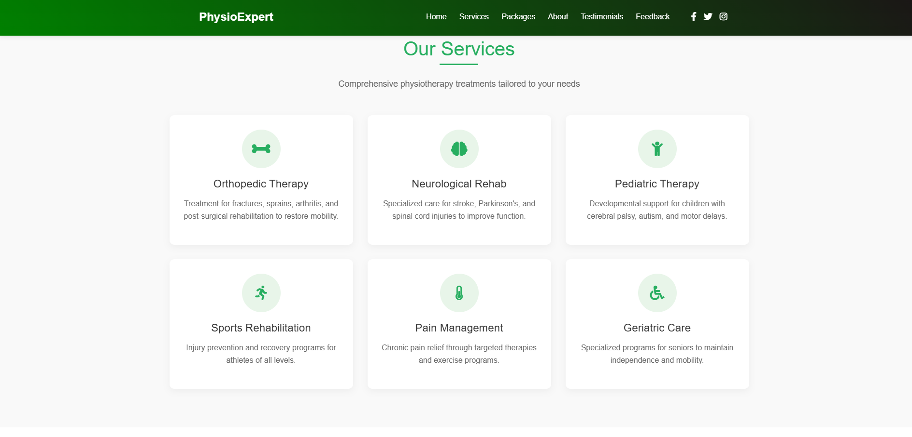
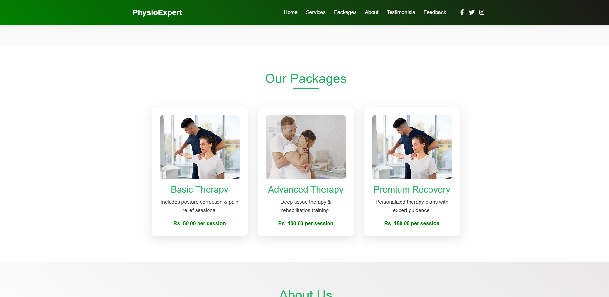
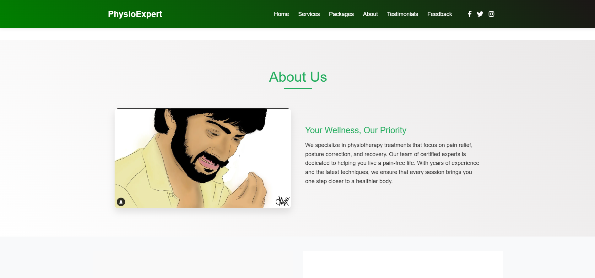
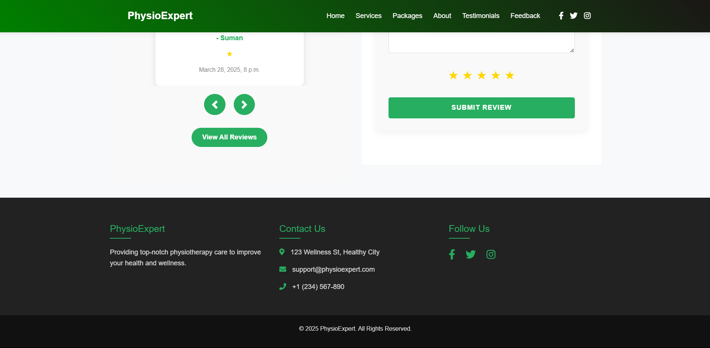
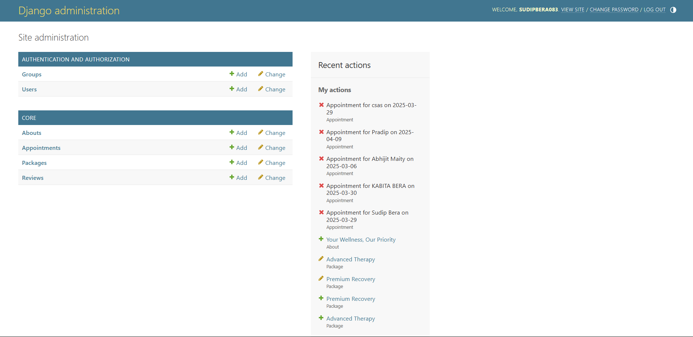

# Physiotherapy Expert Clinic Management System

## Table of Contents
- [Project Overview](#project-overview)
- [Features](#-features)
- [Project Structure](#-project-structure)
- [Live Demo](#-live-demo) 
- [Installation](#-installation)
- [Technology Stack](#-technology-stack)
- [Screenshots](#-screenshots)
- [License](#-license)

## Project Overview

A comprehensive Django-based web application for physiotherapy clinics to manage appointments, patient records, services, and reviews with a modern responsive interface.

## ✨ Features

- **Online appointment booking system**
- **Patient review and rating system**
- **Service package management**
- **Therapist profiles and availability**
- **Responsive mobile-friendly design**
- **Admin dashboard for clinic management**

## 🏗️ Project Structure
physiotherapy-clinic/
├── core/ # Main application
│ ├── migrations/ # Database migrations
│ ├── templates/ # HTML templates
│ ├── models.py # Database models
│ ├── views.py # View functions
│ ├── forms.py # Form classes
│ └── urls.py # URL routing
├── dynamic/ # Project configuration
│ ├── settings/ # Environment settings
│ └── urls.py # Root URL config
├── manage.py # Django CLI
└── requirements.txt # Dependencies
├── templates/ # HTML templates
| └── core/
│── static/ # Static files
│ └── images/ # Images and icons

## 🚀 Live Demo

Experience the application live:

🔗 [Demo Website](https://sudipberauem083.pythonanywhere.com)

## 🛠️ Installation

### Prerequisites
- Python 3.9+
- Django 5.14
- HTML
- CSS
- Bootstrap

## 💻 Technology Stack
# Frontend:

- HTML5, CSS3, JavaScript
- Bootstrap 5
- Font Awesome 6

# Backend:

- Django 4.0+
- Django REST Framework
- WhiteNoise

# Database:

- SQLite

# Deployment:

- Pythonanywhere

## 📸 Screenshots

# Home

# Services

# Packages

# About 

# Contact 

# Admin Pannel

